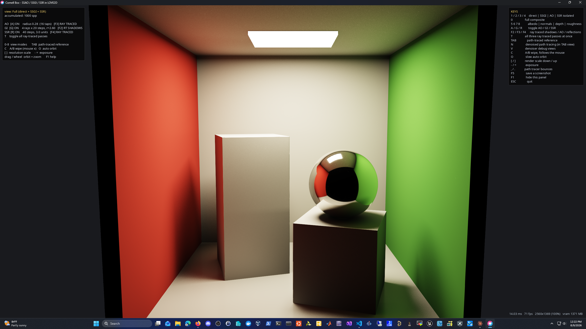

# Cornell Box — SSAO / GI / SSR in LÖVE 2D



Can LÖVE 2D do ambient occlusion, global illumination and screen-space reflections?
**Yes — all three, in real time.** This is the demo that proves it.

The scene is the **Cornell Box**, the reference scene the Cornell Program of Computer
Graphics built in 1984 specifically to validate global illumination renderers. It is
the right pick here because it makes the effects impossible to fake: the red and green
walls bleed colour onto everything, so if your GI is wrong, it shows immediately.

Two renderers run over the same signed-distance scene:

* a **real-time deferred pipeline** — G-buffer, SSAO, screen-space GI, SSR
* a **path-traced reference** — no screen-space anything, converges to ground truth

Press `TAB` to flip between them. That comparison is the point of the demo: it shows
both what the screen-space techniques get right and exactly where they break.

## Running

```
love .
```

Requires LÖVE 11.x. Built and verified against 11.5 on Windows.

## Controls

| Key | |
|---|---|
| `0` | full composite |
| `1` `2` `3` `4` | isolate direct / SSGI / AO / SSR |
| `5` `6` `7` `8` | albedo / normals / depth / roughness |
| `A` `G` `R` | toggle AO / GI / SSR |
| `F2` `F3` `F4` | ray-traced shadows / AO / reflections (needs the rayquery build) |
| `T` | all three ray-traced passes at once |
| `TAB` | path-traced reference |
| `N` | denoised path tracing — 1 spp + SVGF-lite, stable under camera motion |
| `V` | denoiser debug views (raw 1 spp / variance / history / albedo / normals) |
| `B` | spin the tall block — a per-frame TLAS refit, hardware path only |
| `C` | A/B wipe — full render left, direct-only right, follows the mouse |
| `O` | slow auto-orbit |
| `[` `]` | render scale (0.25×–2×) |
| `-` `=` | exposure |
| `,` `.` | path tracer bounce depth |
| drag / wheel | orbit, zoom |
| `F5` | screenshot |
| `F1` | hide help |

Command line: `--shot N`, `--mode N`, `--pt`, `--scale F`, `--nohud` (used for automated captures),
plus `--hw` (hardware ray queries, see HARDWARE_RAYTRACING.md), `--dn` (denoised mode),
`--dnview N`, `--orbit`, `--anim` (block motion), `--bench N`, `--bounces N`, `--tag S`.

## A scene that moves

`B` in the hardware path traced view spins the tall block. It is the only
dynamic object, and it is dynamic in the way real engines do it: the block
lives in its **own bottom-level acceleration structure**, built once in local
space, and its placement is an instance transform in the top-level structure.
Each frame of motion is one `tlas:update()` — a refit costing a fraction of a
millisecond — while the walls, sphere and emitter structures are never touched
([rt_scene.lua](rt_scene.lua)). The denoiser rides through it: the moving
block's freshly disoccluded pixels fall back to spatial filtering for a few
frames while everything else keeps its full history.

The SDF renderers deliberately do not know the block can move — their scene is
a compiled-in distance function. The static scene stays bit-for-bit what it
always was, so every SDF-vs-hardware comparison in HARDWARE_RAYTRACING.md
still holds; motion is where the hardware path stops having an SDF twin at all.

## Denoised path tracing

`N` inside the path traced view (or `--dn`) switches from accumulate-and-reset to
**1 sample per pixel + SVGF-lite**: the tracer also writes first-hit guides
(normal, depth, albedo), a reprojection pass carries the accumulated history
through camera motion instead of discarding it, per-pixel variance is tracked from
luminance moments, and five edge-aware à-trous iterations filter what noise
remains — on demodulated irradiance, so albedo detail is never at risk. The result
converges in place while you orbit ([reproject.glsl](shaders/reproject.glsl),
[variance.glsl](shaders/variance.glsl), [atrous.glsl](shaders/atrous.glsl),
[dnresolve.glsl](shaders/dnresolve.glsl)).

Denoised 1 spp lands within ~1.2% mean absolute difference of the 600-spp
reference on a still camera, at 92 fps at 2560×1440 with hardware rays (52 fps
with the SDF marcher).

The mirror sphere gets its own reprojection: reflected content does not live
on the mirror's surface, it lives at the reflected hit distance behind it, so
the tracer reports that distance and the reprojection pass tracks the
**virtual point** instead of the surface — validated by material identity
rather than surface depth, which is meaningless there. That is what keeps the
sphere's reflections crisp mid-orbit instead of smearing.

Known limit worth knowing: silhouette edges keep a little speckle — jittered
edge pixels alternate between surfaces and never build history.

## The pipeline

Six full-screen passes per frame, all `love.graphics` canvases and GLSL3 pixel shaders.

| | Pass | Notes |
|---|---|---|
| 1 | **G-buffer** [gbuffer.glsl](shaders/gbuffer.glsl) | Raymarches the SDF once. MRT via `love_Canvases[]`: world position + view depth, normal + roughness, albedo + material id. Sub-pixel jitter gives free temporal AA. |
| 2 | **SSAO** [ssao.glsl](shaders/ssao.glsl) | 16-tap cosine hemisphere kernel, then a depth-aware separable blur ([blur.glsl](shaders/blur.glsl)). |
| 3 | **Lighting** [light.glsl](shaders/light.glsl) | Area-light next-event estimation with a stochastic SDF shadow ray, plus the screen-space GI gather. Writes direct and indirect to separate targets so either can be isolated. |
| 4 | **SSR** [ssr.glsl](shaders/ssr.glsl) | Linear march against G-buffer depth, then binary refinement of the crossing point. |
| 5 | **Accumulate** [accum.glsl](shaders/accum.glsl) | Running mean of all three stochastic buffers, reset the moment the camera or a setting changes. |
| 6 | **Composite** [composite.glsl](shaders/composite.glsl) | ACES tonemap, debug views, A/B wipe. |

Everything shares [common.glsl](shaders/common.glsl) — scene SDF, camera, RNG, BRDF —
which `main.lua` prepends to every shader, so the path tracer and the real-time passes
are guaranteed to be looking at identical geometry.

**No matrix uniforms anywhere.** `project()` is written as the exact algebraic inverse of
the camera's `rayDir()`, so SSAO, SSGI and SSR can turn a world position into a UV
directly. It removes a whole class of convention bugs.

**Multi-bounce for free.** The GI gather reads the *previous accumulated frame*, so light
that has already bounced once is available to bounce again. The effective bounce count
grows with the accumulation rather than with the per-frame cost — which is why the colour
bleed keeps deepening for a second or so after you stop moving.

## The hybrid pipeline: same passes, real rays

On the rayquery LÖVE build, `T` swaps the deferred pipeline's three
screen-space visibility tricks for hardware ray queries — individually
toggleable (`F2`/`F3`/`F4`) so each screen-space failure mode can be A/B'd
live against its fix:

* **RT shadows** ([light_hw.glsl](shaders/light_hw.glsl)) — the 56-step
  soft-shadow march becomes one `TerminateOnFirstHit` ray per sample; softness
  comes from the jittered area light plus accumulation, exactly as in the path
  tracer.
* **RTAO** ([rtao.glsl](shaders/rtao.glsl)) — 8 short hemisphere rays ask the
  scene instead of the depth buffer; no self-view blindness, no halos.
* **RT reflections** ([ssr_hw.glsl](shaders/ssr_hw.glsl)) — the same GGX lobe
  and BRDF weight as SSR, but the ray is traced against the TLAS: no screen-edge
  fade, no reflections dying when their subject leaves the frame, and hits are
  shaded with real next-event estimation. The isolated view (`4`) makes the
  difference plain on the sphere's lower half, which reflects geometry SSR
  cannot see.

The pipelines share everything else, so the comparison is visibility source
and nothing more ([rq_common.glsl](shaders/rq_common.glsl) holds the shared
trace helpers). **The price of the whole swap is approximately nothing**:
2.61 ms ray-traced vs 2.54 ms screen-space at 1280×720, and at 2560×1440 the
ray-traced pipeline is marginally *faster* (15.59 vs 15.84 ms) — one ray query
outruns a 40-step depth-buffer march with binary refinement.

## What the comparison actually shows

Flip to `TAB` and back and the screen-space approximations hold up well — but not
perfectly, and the failures are the instructive part:

* **SSGI can only gather light it can see on screen.** Corners and surfaces facing away
  from the camera are slightly under-lit versus the reference. In a closed box this is
  mild; in an open scene it would be severe.
* **SSR cannot reflect what is not on screen.** The dark patch in the middle of the chrome
  sphere is the open front wall of the box — correct in both renderers. But rotate the
  camera until the floor's reflected geometry leaves the frame and the reflection fades,
  which the path tracer never does.
* **SSR is faded out above ~0.8 roughness** and the diffuse SSGI term carries that energy
  instead. A single screen-space ray is a bad estimator for a very wide specular lobe —
  it produces structured ghosts of nearby objects rather than a blur. Fading out is the
  honest fix, and it is what shipping engines do.
* **AO is an approximation stacked on an approximation.** It multiplies the indirect term
  only, which is convention rather than physics. The path tracer needs no AO at all — its
  occlusion is just the shadow rays doing their job. Press `A` mid-comparison to see how
  much of the "contact" look is real and how much is the cheat.

## Performance

Measured by wall clock across the whole process, so these are conservative:

* real-time pipeline, 1280×720: **~290 fps**
* path tracer, 1280×720, 5 bounces: **~200 samples/sec**, visually converged in a couple of seconds
* VRAM: ~170 MB at 1280×720, ~42 MB at half scale

Use `[` if your GPU is slower; the composite samples the lower-resolution buffers with
normalised UVs so nothing else has to change.

## LÖVE-specific gotchas worth knowing

Three things cost real debugging time here, and none of them are obvious:

1. **`setBlendMode("replace")` defaults to the `"alphamultiply"` alpha mode**, which scales
   the output RGB by the output alpha. That is fine when alpha means coverage, and
   catastrophic for a G-buffer where alpha carries view depth or roughness — it silently
   stored `position * depth` and `normal * roughness`. Always pass
   `setBlendMode("replace", "premultiplied")` when rendering data rather than pixels.
2. **The `"add"` blend mode sets `srcFactorA` to zero**, deliberately leaving destination
   alpha untouched. So the standard trick of counting accumulated samples in the alpha
   channel silently never increments. The path tracer takes the sample count as a uniform.
3. **Calling `rnd(seed)` twice inside one expression is undefined** when the parameter is
   `inout` — the compiler may hand both calls the same value, quietly correlating your
   samples. `common.glsl` provides `rnd2()`, which sequences them as separate statements.

## Scene

Standard Cornell geometry with two additions that give SSR something to do: the short block
carries a chrome sphere, and the floor is polished to 0.2 roughness. Wall reflectances are
the original spectral-derived values — white `0.725, 0.710, 0.680`, red `0.630, 0.065, 0.050`,
green `0.140, 0.450, 0.091`.

Walls are modelled as real slabs rather than an inverted box, so the SDF stays valid with
the camera sitting outside the room looking in through the open face.
